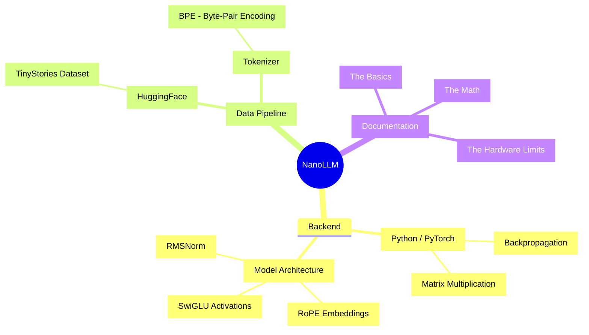

<div align="center">

# 🧠 NanoLLM

[](https://github.com/NoticedXAaryan/NanoLLM/stargazers)
[](https://github.com/NoticedXAaryan/NanoLLM/network/members)
[](LICENSE)
[](#)
[](#)

> *"A completely from-scratch, modern Large Language Model built to be the ultimate educational resource."*

*NanoLLM is not just a codebase—it's a masterclass in building modern AI from the ground up.*

</div>

---

> [!NOTE]
> **Who is this for?**
> If you've ever wanted to understand how a Large Language Model actually works under the hood, but found research papers too dense and standard tutorials too outdated, you are in the right place. This repo walks you from total beginner to understanding the exact math behind LLaMA 3.

## 🚀 What is NanoLLM?

NanoLLM is a custom-built, 12.6 million parameter language model. It was trained entirely from scratch on a single laptop GPU (RTX 4060 Ti 8GB) using the **TinyStories** dataset.

Instead of copying old 2019 GPT-2 tutorials, NanoLLM uses the exact architectural blueprints powering today's state-of-the-art open-source models:
- **RoPE** (Rotary Position Embeddings)
- **SwiGLU** (Feed-Forward Activations)
- **RMSNorm** (Root Mean Square Normalization)
- **Weight Tying** (Memory optimization)

## 🏗️ Project Architecture



---

## 🚦 Quick Start

**1. Clone and install dependencies:**
```bash
git clone https://github.com/noticedXAaryan/NanoLLM.git
cd NanoLLM
pip install -r requirements.txt
```

**2. Talk to the model:**
```bash
python generate.py
```
> *Note: NanoLLM was trained on TinyStories. It speaks in the vocabulary of a 4-year-old child and excels at short, creative fairy tales!*

**Example Real Output:**
- **Prompt:** `"Once upon a time, there was a little girl named Lily."`
- **Context Length:** `100 Tokens`
- **Exact Output:** 
> *"Once upon a time, there was a little girl named Lily. She lived in a house with her mommy and daddy was very important. Lily loved to play with her daddy, but she had a big brother. One day, daddy took her two weeks later they decided to visit her mommy, daddy, Timmy and Lily loved her little brother, who had to visit her mommy wanted to go outside to the house for a visit her older and his big brother wanted her. When he was their couch. They played"*

**3. Train it yourself:**
```bash
python train.py
```

---

## 📚 The Deep Dive Curriculum

This documentation is designed as a **Dual-Layered Book**. 
Read the main body for a quick, high-level understanding. Expand the `🔬 Deep Dive` sections if you want the hardcore math, edge-cases, and textbook explanations.

| Chapter | Description | What You'll Learn |
|---------|-------------|-------------------|
| **[00. The Absolute Basics](docs/00_the_absolute_basics.md)** | Start here. From zero to neural networks. | Matrices, Tensors, Backpropagation, Chain Rule. |
| **[01. Architecture Explained](docs/01_architecture_explained.md)** | The blueprint of NanoLLM vs GPT-2. | RoPE math, SwiGLU intuition, Attention mechanisms. |
| **[02. The Training Journey](docs/02_the_training_journey.md)** | Surviving hardware limits. | VRAM swapping, Gradient Accumulation sequences. |
| **[03. Build It Yourself](docs/03_build_it_yourself.md)** | Line-by-line code breakdowns. | AdamW optimizers, `loss.backward()`, handling `NaN` loss. |
| **[04. Model Behavior & Inference](docs/04_model_behavior.md)** | How to drive the engine. | Context length extrapolation, repetition loops, temperature. |

---

<div align="center">
  <p><strong>Created by <a href="https://www.linkedin.com/in/noticedxaaryan">Aaryan</a></strong></p>
  <p><em>"Any fool can write code that a computer can understand. Good programmers write code that humans can understand." — Martin Fowler</em></p>
</div>
