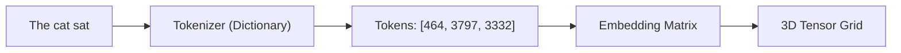
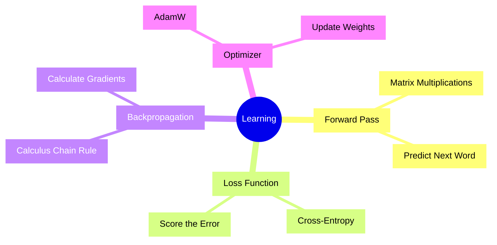
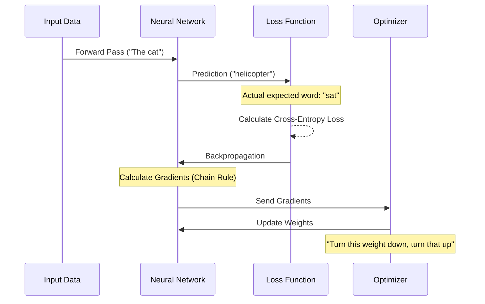

# 🌱 The Absolute Basics: From Zero to Neural Networks

> *"Before we can run, we must learn to walk."*

[🏠 Main Menu](../README.md) | [Next: Architecture Explained ➡️](./01_architecture_explained.md)

---

If you have a basic understanding of Python, you can absolutely build a Large Language Model. But before we dive into the complex architecture of NanoLLM, we need to understand the fundamental building blocks of modern Artificial Intelligence.

How does a computer read a word? How does it "learn"?

## 1. How Computers "Read" (Tokens & Embeddings)

Computers only understand numbers (0s and 1s). If you feed a neural network the raw string **"The cat sat"**, it will instantly crash. We have to translate English text into pure Mathematics.

### Step 1: Tokenization (The Dictionary)
We use a **Tokenizer** (acting like a giant dictionary). It assigns a unique numerical ID to every word, sub-word, or character. 

| Word | Token ID |
|------|----------|
| "The" | `464` |
| "cat" | `3797` |
| "sat" | `3332` |

> [!TIP]
> **Sub-words?** If the tokenizer sees a word it doesn't know, like "NanoLLM", it might split it into three tokens: `[Nano, L, LM]`. This keeps the dictionary size small and highly efficient!
> 
> 🔗 **External Tool:** Play around with the [OpenAI Interactive Tokenizer](https://platform.openai.com/tokenizer) to see exactly how GPT-4 chunks text into sub-words!
> 🔗 **GitHub Repo:** Want to build your own Tokenizer from scratch? Check out Andrej Karpathy's [minbpe repository](https://github.com/karpathy/minbpe).

### Step 2: The Embedding Matrix (The Meaning)
A Token ID is just a label. There is no "meaning" yet. Every single token ID looks up its own personal list of numbers (a **Vector**). 

In NanoLLM, this vector is 384 numbers long. These numbers define the "meaning" of the word in a high-dimensional geometric space! Words with similar meanings (like "cat" and "dog") will have mathematically similar vectors pointing in the same direction.

🔬 <strong>Deep Dive: The Math of Meaning (Pythagoras & Cosine Similarity)</strong>

How does the computer mathematically know that "King" and "Queen" are related? It uses the same math you learned in high school geometry!

If you plot two vectors on a graph, you can find the distance between them using the **Pythagorean Theorem** ($a^2 + b^2 = c^2$). In a 384-dimensional space, the formula simply scales up:
$$ Distance = \sqrt{(x_1 - y_1)^2 + (x_2 - y_2)^2 + ... + (x_{384} - y_{384})^2} $$

However, AI models prefer to measure the **angle** between the two lines, rather than the raw distance. This is called **Cosine Similarity**.
$$ \cos(\theta) = \frac{A \cdot B}{||A|| ||B||} $$

If the angle between the vector for "King" and "Queen" is very small (cosine similarity close to 1.0), the model instantly knows these words have almost the exact same contextual meaning!

🎥 **YouTube Resource:** To truly understand how these vectors map "meaning" in geometric space, watch [Word Embeddings by 3Blue1Brown](https://www.youtube.com/watch?v=gQddtTkdG14).
🔗 **Documentation:** Read the [PyTorch Official Tensor Tutorial](https://pytorch.org/tutorials/beginner/blitz/tensor_tutorial.html) to start coding them in Python.

### Step 3: The Tensor (The Grid)
The sentence "The cat sat" is now a 3D grid of floating-point numbers:
`Batch Size (1) × Sequence Length (3) × Embedding Size (384)`

This grid of numbers is called a **Tensor**. It is now ready to enter the Neural Network!

🔬 <strong>Deep Dive: What exactly is a Tensor?</strong>

A Tensor is simply a fancy mathematical word for a multi-dimensional array of numbers.
*   **0D Tensor:** A scalar (a single number like `5`).
*   **1D Tensor:** A Vector (a list of numbers `[1, 2, 3]`).
*   **2D Tensor:** A Matrix (like an Excel spreadsheet).
*   **3D Tensor:** A Cube of numbers (this is what language models use!).

PyTorch is a Python library specifically designed to do super-fast math on these Tensors using your GPU. 

---

## 2. How Computers "Learn" (Backpropagation)

Okay, so we fed our Tensor into the model. Now we want the model to predict the next word. But when we first initialize the model, its "brain" is full of completely random numbers (Weights). It will output random garbage.

How do we teach it? We use **Backpropagation**.

### 1. The Forward Pass (Guessing)
We feed the model: `"The cat"`.
The model runs millions of matrix multiplications and makes a guess. It predicts the next word is: `"helicopter"`.

### 2. The Loss Function (Grading the Test)
We know the actual next word should have been `"sat"`. We use a mathematical function called **Cross-Entropy Loss**. It compares the probability of the guess ("helicopter") to the truth ("sat") and spits out a score. A high score (like `Loss: 8.5`) means the model was terribly wrong.

### 3. Backpropagation (Finding the Blame)
Here is the magic of Calculus. The computer works backwards through the entire neural network. It calculates a **Gradient** for every single parameter. A Gradient is simply a direction: *"If I increase this specific weight by 0.01, will my Loss go up or down?"*

### 4. The Optimizer (Fixing the Brain)
Now we use an **Optimizer** (like AdamW). It looks at all the Gradients and says: *"Okay, to get closer to the word 'sat', we need to turn this weight down by 0.01, and turn that weight up by 0.05."* It updates the weights. The model has just "learned"!

🔬 <strong>Deep Dive: The Calculus of Backpropagation</strong>

If you want to build AI from scratch, you cannot escape the **Chain Rule of Calculus**.

A neural network is just a giant composite mathematical function: $f(g(h(x)))$. 
To figure out how much a weight deep inside the network ($w_1$) contributed to the final error ($L$), we multiply the derivatives backwards from the output to the input.

**The Chain Rule unrolled:**
$$ \frac{\partial L}{\partial w_1} = \frac{\partial L}{\partial y} \cdot \frac{\partial y}{\partial h} \cdot \frac{\partial h}{\partial w_1} $$

When you call `loss.backward()` in PyTorch, it is automatically calculating these massive partial derivatives for all 12.6 million parameters in NanoLLM simultaneously using an Autograd engine!

🎥 **YouTube Resources:** 
1. Watch [What is Backpropagation really doing? by 3Blue1Brown](https://www.youtube.com/watch?v=Ilg3gGewQ5U).
2. Take [Neural Networks: Zero to Hero by Andrej Karpathy](https://karpathy.ai/zero-to-hero.html). It is the definitive guide to building this exact math in Python.

🔗 **GitHub Repo:** If you want to code a backpropagation engine from scratch in pure Python to see exactly how the math works, clone [Andrej Karpathy's micrograd](https://github.com/karpathy/micrograd).

---

## 🚀 Further Reading & Essential Resources
Before moving on to the Architecture section, here are the absolute best places on the internet to solidify your understanding of LLM basics:

- 📄 **The Bible of LLMs:** Read the original [Attention Is All You Need (2017) Paper](https://arxiv.org/abs/1706.03762).
- 🧑‍🏫 **HuggingFace NLP Course:** An incredible, free, hands-on [NLP Course by HuggingFace](https://huggingface.co/learn/nlp-course).
- 🎥 **How GPT works:** Another stellar visual breakdown by [3Blue1Brown on Transformers](https://www.youtube.com/watch?v=wjZofJX0v4M).
- 💻 **Karpathy's Let's Build GPT:** The ultimate video guide: [Let's build GPT: from scratch, in code, spelled out.](https://www.youtube.com/watch?v=kCc8FmEb1nY)

---

[🏠 Main Menu](../README.md) | [Next: Architecture Explained ➡️](./01_architecture_explained.md)
