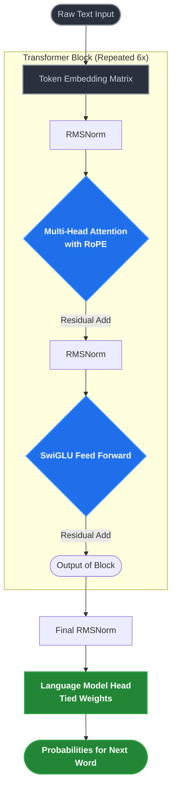

# 🏗️ Architecture Explained: The "Why"

> *"Deep diving into the exact modern choices that separate a toy model from a state-of-the-art LLM."*

[⬅️ Previous: The Basics](./00_the_absolute_basics.md) | [🏠 Main Menu](../README.md) | [Next: The Training Journey ➡️](./02_the_training_journey.md)

---

When building **NanoLLM**, the easiest path would have been to copy an old PyTorch GPT-2 tutorial. But the AI world has moved incredibly fast. I wanted to build something using the **exact same architectural blueprints** as today’s open-source giants: **LLaMA 3**, **Mistral**, and **Gemma**.

Here is the exact visual map of how NanoLLM processes text. Notice how the data flows sequentially from node to node.

---

## 1. RoPE (Rotary Position Embeddings)

**🤔 The Problem: Position Blindness**
Neural networks don’t inherently understand the order of words. If you feed the network `["The", "cat", "sat"]`, it just sees a bag of words unless you explicitly tell it *where* those words are. Older models (like GPT-2) used **Absolute Position Embeddings**—they literally hardcoded a unique identifier into the 1st word, the 2nd word, etc. But this breaks down if the text gets longer than what the model was trained on.

**💡 The Solution: RoPE**
**RoPE** (Rotary Position Embeddings) is the modern standard used by LLaMA. Instead of adding a fixed number, RoPE applies a **mathematical rotation** to the vectors based on their relative positions. 

> [!TIP]
> **Think of it like a clock:** If the word "cat" is at position 1, its vector points to 1 o'clock. If it's at position 2, it points to 2 o'clock. The attention mechanism can easily calculate the distance between words by just looking at the angle between their vectors! This allows the model to extrapolate to much longer contexts naturally.

🔬 <strong>Deep Dive: The Math of RoPE</strong>

RoPE encodes the absolute position with a rotation matrix and directly injects relative position information into the self-attention operation. For a token embedding vector $x$ at position $m$, the rotated vector $f_{q}(x_{m}, m)$ is computed by rotating pairs of features in 2D planes.

The rotation matrix $R_{\Theta,m}^{d}$ rotates the $2D$ coordinate $(x_{i}, x_{i+1})$ by angle $m\theta_i$, where $\theta_i = 10000^{-2(i-1)/d}$.

This guarantees that the inner product of query at position $m$ and key at position $n$ only depends on their relative distance $(m - n)$:
$$ \langle f_{q}(x_{m}, m), f_{k}(x_{n}, n) \rangle = g(x_{m}, x_{n}, m - n) $$

📚 **Reference Paper:** [RoFormer: Enhanced Transformer with Rotary Position Embedding (2021)](https://arxiv.org/abs/2104.09864)

---

## 2. RMSNorm (Root Mean Square Normalization)

**🤔 The Problem: Exploding Gradients**
As data flows through 6 layers of math, the numbers can get wildly huge or microscopically small. Older models used **LayerNorm**, which forces the data to stay stable by centering it (subtracting the mean) and scaling it (dividing by variance). 

**💡 The Solution: RMSNorm**
It turns out, calculating and subtracting the mean is computationally expensive and mostly unnecessary. **RMSNorm** simply scales the data by its Root Mean Square. It achieves the exact same stability as LayerNorm but is about **10% to 20% faster to compute**. 

> [!IMPORTANT]
> When you're training a model for 20,000 steps, saving 15% computational time per layer is a massive win for laptop GPUs!

🔬 <strong>Deep Dive: The Math of RMSNorm</strong>

Unlike LayerNorm, which computes:
$$ y = \frac{x - \mu}{\sqrt{\sigma^2 + \epsilon}} \gamma + \beta $$

RMSNorm assumes the mean is roughly zero and only normalizes by the root mean square:
$$ RMS(a) = \sqrt{\frac{1}{n} \sum_{i=1}^{n} a_i^2} $$
$$ y = \frac{x}{RMS(x)} \odot \gamma $$

This eliminates the need to calculate the mean $\mu$, which requires an extra synchronization pass across the vector, directly speeding up GPU execution.

📚 **Reference Paper:** [Root Mean Square Layer Normalization (2019)](https://arxiv.org/abs/1910.07467)

---

## 3. SwiGLU Activations

**🤔 The Problem: Weak Reasoning**
Inside every Transformer block is a Feed-Forward Network (FFN). This is essentially the "brain" where the model stores logic. For decades, the standard filter (activation function) was ReLU or GELU.

**💡 The Solution: SwiGLU**
**SwiGLU** (Swish Gated Linear Unit) splits the incoming data into two halves. It passes one half through a non-linear curve, and multiplies it by the other half (acting as a "Gate"). While it requires three matrices instead of two, SwiGLU has empirically proven to pack significantly more "reasoning capability" per parameter than GELU. This is exactly how a tiny 12.6M parameter model like NanoLLM can write coherent, logical short stories!

🔬 <strong>Deep Dive: The Math of SwiGLU</strong>

Standard FFN (with ReLU):
$$ FFN(x) = ReLU(x W_1 + b_1) W_2 + b_2 $$

SwiGLU FFN (No biases used in modern implementations):
$$ Swish(x) = x \cdot \sigma(\beta x) $$
$$ SwiGLU(x) = (Swish(x W) \odot (x V)) W_2 $$

It acts as a dynamic gate, where the network learns to dynamically "allow" or "block" information from passing through based on the context.

📚 **Reference Paper:** [GLU Variants Improve Transformer (2020)](https://arxiv.org/abs/2002.05202)

---

## 4. Weight Tying

**🤔 The Problem: Memory Bloat**
In NLP models, the **Input Embedding** (translating words into numbers) and the **Language Model Head** (translating numbers back into words at the very end) are usually two massive memory blocks. 

**💡 The Solution: Weight Tying**
In NanoLLM, I used **Weight Tying**—literally pointing both layers to the exact same block of memory in PyTorch using `self.lm_head.weight = self.tok_emb.weight`. 

**The Result:** I saved roughly **1.5 Million parameters** of VRAM space, and it actually stabilizes the training because the model doesn't have to learn the definition of a word twice (once for reading, once for speaking).

---

[⬅️ Previous: The Basics](./00_the_absolute_basics.md) | [🏠 Main Menu](../README.md) | [Next: The Training Journey ➡️](./02_the_training_journey.md)
