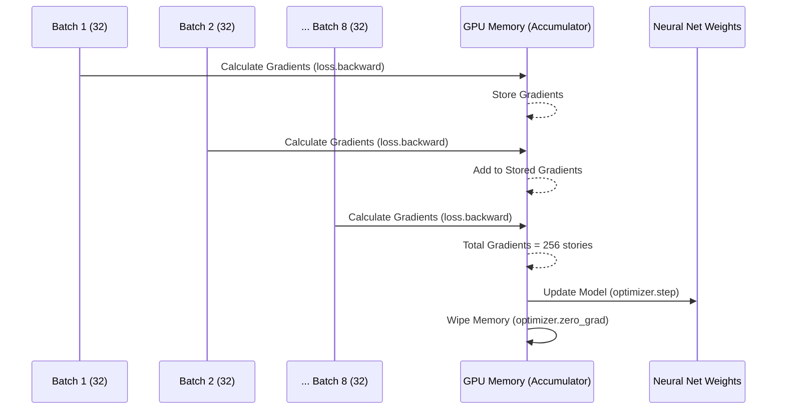
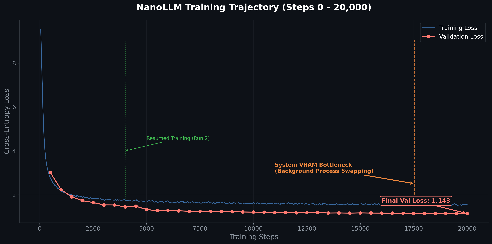

# 🚀 The Training Journey: Fighting Hardware Limits

> *"It's not just about math; it's about engineering against physical limits."*

[⬅️ Previous: Architecture](./01_architecture_explained.md) | [🏠 Main Menu](../README.md) | [Next: Build It Yourself ➡️](./03_build_it_yourself.md)

---

I trained **NanoLLM** on my local Windows laptop equipped with an **NVIDIA RTX 4060 Ti (8GB VRAM)**. 

Here is the exact story of how I squeezed 20,000 training steps out of that GPU, the system bottlenecks I survived, and the empirical results proving the model works.

## 1. The Dataset: TinyStories

You can't train a baby LLM on Wikipedia—it doesn't have the parameter capacity (brain power) to memorize world history. 

Instead, I used **TinyStories**. It's a dataset of 2.1 million synthetically generated short stories using only words a 3-year-old child would understand. This allows a tiny model (like our ~12M parameter NanoLLM) to completely master English grammar, logic, and narrative structure without being bogged down by complex vocabulary.

🔬 <strong>Deep Dive: How TinyStories was Made</strong>

Microsoft Research created the TinyStories dataset by prompting GPT-4 to generate short stories. They forced GPT-4 to only use a very restricted vocabulary list (words a 3-to-4-year-old knows). 

By stripping away the "knowledge" of the world (like historical facts, science, and complex names), the AI is forced to focus entirely on learning *how* to speak English. This proved that models with as few as 10 Million parameters can generate fluent, coherent stories if the dataset is clean enough!

📚 **Reference Paper:** [TinyStories: How Small Can Language Models Be and Still Speak Coherent English? (2023)](https://arxiv.org/abs/2305.07759)

---

## 2. Overcoming the 8GB VRAM Wall

To train a model effectively, you need a large "Batch Size" (the number of stories the model looks at simultaneously). Modern papers suggest an effective batch size of at least **256**. 

If I tried to push 256 stories at once into my 8GB GPU, it immediately crashed with an `Out Of Memory` error. My RTX 4060 maxed out at exactly **32 stories per batch**.

### 💡 The Solution: Gradient Accumulation

I used a brilliant engineering trick. I calculate the math in small chunks of 32, but I **don't** update the model yet. I just stash the math away. After 8 chunks, I add them all together and *then* update the model. 

This simulates a massive batch size of 256 without ever exceeding the 8GB VRAM limit!

---

## 3. The Great Bottleneck (Step 17,550)

If you look at the official training graph below, you'll notice something strange happened toward the end of the run.

At exactly **Step 17,550**, the training speed suddenly dropped off a cliff.
- **Before:** ~1,315 ms / step (processing ~49,500 tokens per second).
- **After:** ~3,585 ms / step (processing ~18,200 tokens per second).

**What actually happened?**
I was monitoring my Windows task manager and realized that a completely separate background application (Ollama) had silently spun up and claimed a chunk of my VRAM. 

Because my 8GB VRAM was already fully saturated by NanoLLM, Windows was forced to start **"VRAM Swapping"**—moving data back and forth between my lightning-fast GPU memory and my incredibly slow system RAM. 

> [!WARNING] 
> **The Lesson:** When training models at the absolute edge of your hardware limits, close absolutely everything. A single background app claiming 500MB of VRAM will force your GPU to swap to system RAM, destroying your training throughput by 2.5x! It was a harsh system-level engineering lesson.

🔬 <strong>Deep Dive: VRAM vs Shared GPU Memory</strong>

In modern Windows (WDDM), if your dedicated VRAM fills up, the OS will automatically overflow data into your "Shared GPU Memory" (which is actually just your CPU's system RAM). 

While this prevents PyTorch from instantly crashing with a `CUDA OutOfMemoryError`, it is a silent killer. Reading from system RAM across the PCIe bus is orders of magnitude slower than reading from the GPU's internal GDDR6 memory.

**How to detect this:** Run `nvidia-smi` in your terminal. If your `Memory-Usage` hits exactly your maximum capacity, check your Windows Task Manager. If "Shared GPU memory" is above 0.1 GB during a PyTorch training loop, you are swapping and your training speed has been destroyed.

Despite the slowdown, the training loop was robust enough to push through, successfully saving the final weights at Step 20,000 with a fantastic Validation Loss of `1.143`.

---

[⬅️ Previous: Architecture](./01_architecture_explained.md) | [🏠 Main Menu](../README.md) | [Next: Build It Yourself ➡️](./03_build_it_yourself.md)
