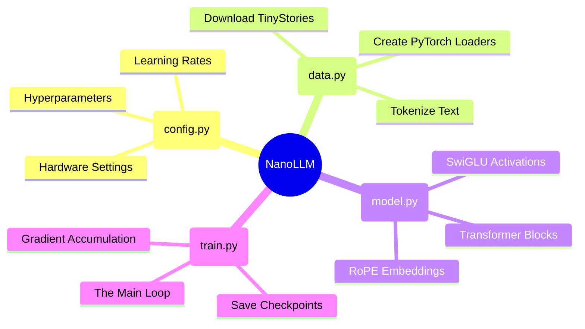

# 🛠️ Build It Yourself: The Code Breakdown

> *"Line-by-line understanding of the engine."*

[⬅️ Previous: The Training Journey](./02_the_training_journey.md) | [🏠 Main Menu](../README.md)

---

If you're reading this, you want to know how the code actually works. I designed this repository to be completely standalone. You do not need to watch hours of external YouTube videos to piece this together.

Here is the central nervous system of the project. Everything is driven by `config.py`, which feeds settings into the three main engines.



---

## 1. The Training Loop (Line-by-Line)

If you open `train.py`, you will find the heart of the entire project: the Training Loop. Let's break down exactly what each line does.

```python
# 1. Zero out old gradients
optimizer.zero_grad()
```
**Why do we do this?** PyTorch is designed to "accumulate" math by default. If we don't wipe the slate clean at the start of a new step, the gradients from Step 1 will get added to Step 2, and the model will learn garbage.

```python
# 2. The Forward Pass (Guessing)
logits = model(x)
```
**What happens here?** We feed a batch of stories (`x`) into the model. The model does billions of calculations and spits out `logits`—its raw, unfiltered guesses for what the next words should be.

```python
# 3. Grading the Test
loss = F.cross_entropy(logits, y)
```
**Why this function?** `cross_entropy` compares the model's guesses (`logits`) to the actual correct words (`y`). It spits out a single number (the `loss`). A high number means the model is stupid; a low number means the model is smart.

```python
# 4. The Backward Pass (Finding the blame)
loss.backward()
```
**What happens in the background?** This triggers the Backpropagation we discussed in the Basics guide. PyTorch calculates the partial derivatives for all 12.6 million parameters, figuring out exactly which numbers need to go up or down to make the loss smaller next time.

```python
# 5. Gradient Clipping
torch.nn.utils.clip_grad_norm_(model.parameters(), 1.0)
```
**Why clip gradients?** If you don't use this, sometimes a gradient calculation can "explode" (resulting in a massive number like 5,000,000). The optimizer would then destroy the model's brain by taking a huge step. Clipping says: *"No matter what, do not take a step larger than 1.0"*.

```python
# 6. Updating the Brain
optimizer.step()
```
**The finale:** The AdamW optimizer actually applies the changes to the model's weights. The model is now officially smarter than it was 1 second ago!

<details>
<summary>🔬 <strong>Deep Dive: The AdamW Optimizer</strong></summary>

Why do we use `AdamW` instead of standard Stochastic Gradient Descent (`SGD`)?

Adam (Adaptive Moment Estimation) keeps track of an exponentially decaying average of past gradients (momentum). This allows it to speed up when it is confident in a direction, and slow down when the gradients start fluctuating wildly.

The "W" stands for **Weight Decay**. It mathematically penalizes the model for having weights that are too large, which forces the model to distribute its "knowledge" across all neurons rather than relying heavily on just a few. This drastically reduces overfitting.

📚 **Reference Paper:** [Decoupled Weight Decay Regularization (2017)](https://arxiv.org/abs/1711.05101)
</details>

---

## 2. Debugging & Edge Cases

When you start tweaking `config.py` to build your own custom models, you will inevitably break something. Here are the most common edge cases and how to fix them.

### 🚨 "Help! My loss is NaN!"
If your terminal prints `Loss: NaN` (Not a Number), your training has completely collapsed. The model's brain just exploded.
*   **The Cause:** Your Learning Rate (`max_lr`) is too high. The optimizer took a step so large that the math overflowed your GPU's capacity.
*   **The Fix:** Open `config.py` and divide `max_lr` by 10. Start again.

### 🚨 "Help! My model is just predicting 'the the the' over and over!"
*   **The Cause:** This is called "mode collapse." The model found a cheap mathematical loophole where predicting the most common word in the English language ("the") technically lowers the loss slightly without requiring any actual reasoning.
*   **The Fix:** This usually happens early in training. Let it run! If it continues after 5,000 steps, your network might be too small to learn complex patterns, or your learning rate is too low.

### 🚨 "Help! CUDA Out of Memory (OOM)!"
*   **The Cause:** You pushed too much data into the GPU at once.
*   **The Fix:** Lower your `batch_size` in `config.py`. If you want to keep the same effective learning power, lower the `batch_size` but increase the `gradient_accumulation_steps` by the exact same multiplier.

<details>
<summary>🔬 <strong>Deep Dive: Karpathy's Debugging Guide</strong></summary>

Debugging Neural Networks is notoriously difficult because they almost never throw Python errors. They "fail silently" by just performing poorly.

Andrej Karpathy's **"A Recipe for Training Neural Networks"** is widely considered the holy grail of debugging AI models. 
His #1 rule? *"Neural net training fails silently."* You must overfit a single batch of data first to prove your code works before training on the whole dataset.

📚 **Reference Article:** [A Recipe for Training Neural Networks](http://karpathy.github.io/2019/04/25/recipe/)
</details>

---

<br>
<div align="center">
  <p>👉 <strong>Ready to try it?</strong> Run <code>python train.py</code> and watch your GPU go to work!</p>
</div>
