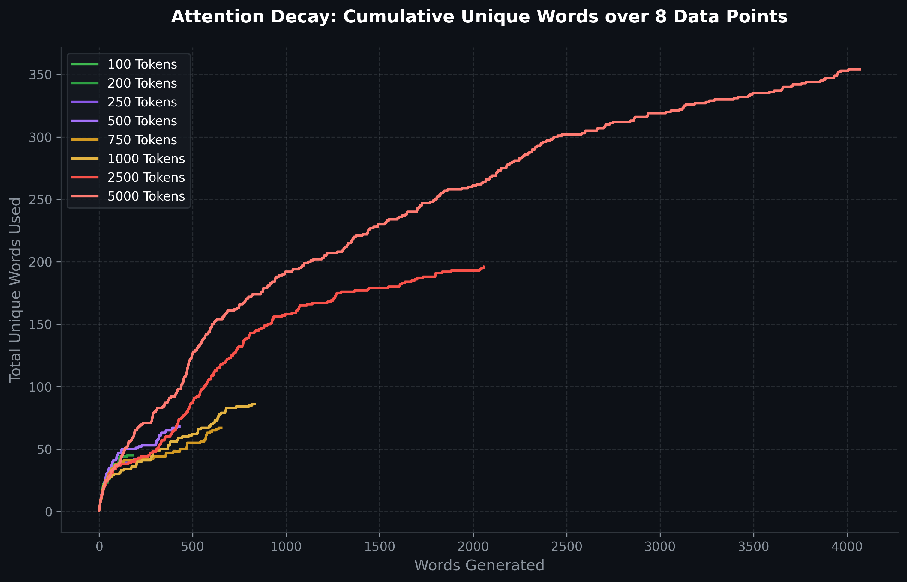

# 04. Model Behavior under Context Stress

The following document maps exactly how NanoLLM behaves as we increase the context length. 
This is the **exact, word-for-word empirical output** from the model without any compression, hiding, or editing.

## 📊 Empirical Data: The Attention Decay Graph

As you scroll through the massive raw outputs below, refer to this graph. It plots the "Cumulative Unique Words Used". You will visually see exactly where the model stops being creative and crashes into a flat horizontal repetition loop.

---

## Stop: 100 Tokens

- **Prompt:** `A brave knight went into the dark cave.`
- **Context Length:** `100 Tokens`
- **Exact Output:**

> A brave knight went into the dark cave. He saw that the shield looked at him and was just trying to save the princess. He was wearing a knight, ready to fighted!

The knight thanked the knight stood up to save the princess with the shield. After a brave knight. He was brave knight fought the knight and defeated the dragon with the shield, and he fought bravely faced the knight's weapon. The knight and the princess said:

The knight and the knight defeated the knight defeated the knight defeated. The
--------------------------------------------------

---

## Stop: 200 Tokens

- **Prompt:** `A brave knight went into the dark cave.`
- **Context Length:** `200 Tokens`
- **Exact Output:**

> A brave knight went into the dark cave. He was looking around and faced the knight. He saw a castle was very big, dangerous. A knight was using a big dragon.

The knight fought brave knight stepped around the knight fought a dragon. The dragon was ready to defeat. He fought brave knight fought brave knight fought dragons with a sword and fought the dragon. But he shouted at the dragon shouted his sword.

The knight fought strong and fought brave knight fought the knight fought hard. He fought back and defeated the knight defeated the knight. When he fought.

The knight fought for a long battle was so far away the knight fought the knight defeated the knight fought the knight defeated the dragon defeated the dragon and he fought a sword and the knight defeated the knight defeated the dragon defeated the knight and the knight fought the princess.

The knight and the knight defeated the brave knight fought the dragon and he fought the knight defeated the knight fought the knight, but the brave knight and the knight
--------------------------------------------------

---

## Stop: 250 Tokens

- **Prompt:** `A brave knight went into the dark cave.`
- **Context Length:** `250 Tokens`
- **Exact Output:**

> A brave knight went into the dark cave. He saw the dragon was ready to help her. The princess was very bravely brave knight said, "I will save the princess, knight. I will save her." The knight said, "I am looking for the dragon, I will save the knight, but I am not hurt meow, but I will save me!"

The brave knight fought the knight, so the brave knight, fought the dragon, and the dragon was so brave knight and he will help meow for saving your dragon, bravely. But, and the brave knight, and I will not give the knight!" The knight and he wanted to save the mean dragon, and I will give meow, but I will save the knight, will."

The brave knight, and the knight and the dragon was very brave knight, and the knight and the knight and the knight, and the brave knight fought brave knight fought the dragon was the princess. He fought with the brave knight and the dragon and the dragon and the knight fought the brave prince, he was very brave, and the brave knight saved the dragon saved the knight saved the dragon, and the princess and the knight fought the princess and
--------------------------------------------------

---

## Stop: 500 Tokens

- **Prompt:** `A brave knight went into the dark cave.`
- **Context Length:** `500 Tokens`
- **Exact Output:**

> A brave knight went into the dark cave. He wanted to save the girl from a dangerous cave. He opened the door and saw that the princess was in a big hole.

When the knight fought for days later, he was brave knight and faced the princess said "Please, the girl had a brave knight. I saw the knight said he had to defeat. The brave knight put her to fight. She said to the princess won.

The brave knight fought and fought the knight said, she had to save the princess must not be defeated.

The princess and the dragon was so the brave knight defeated the brave knight and the princess was defeated and the castle was left the brave knight saved the princess and she was the brave knight and the princess and the brave knight and saved the knight.
The knight and the knight and the princess saved the princess saved the princess was saved the knight and the princess was the princess and the knight and the knight.

The princess and the knight and the knight and the princess and knight won the dragon and the knight and the brave princess wore the knight and the knight and the knight and the brave princess was very brave knight and the knight and the princess, and the knight and the dragon and the princess, but the knight and the dragon and the knight and the princess and the brave knight and the knight and the knight and the princess. The knight and the knight and the knight and the princess and the knight and the knight and the knight and the princess and the knight. The knight was very brave knight and the princess. The knight and the knight and the knight and the princess and the knight, who was the knight.Once upon away. The knight and the knight and the sword and the princess lived happily agreed to the knight and the knight and the princess were safe. The knight and the dragon.

The knight and the princess. The knight and the dragon and the dragon. They lived happily lived happily. They were both had a princess, the knight and the knight and the knight and the knight and the knight and the knight and the knight and the knight and the knight lived happily ever after a knight and the knight and the knight and the princess and the knight and the princess and the knight and the knight. They are the princess and the knight and the knight and princess lived happily.
--------------------------------------------------

---

## Stop: 750 Tokens

- **Prompt:** `A brave knight went into the dark cave.`
- **Context Length:** `750 Tokens`
- **Exact Output:**

> A brave knight went into the dark cave. He heard a brave knight was stuck in a big problem. The knight had to save the dragon. He used his sword and he had a sword but the knight was determined to fight for the knight was so he fought the dragon's sword to defeat the knight and the knight had no one big one of the dragon. The dragon was defeated the knight and was the knight's shield and the knight.

The knight fought very brave knight had not the knight fought the dragon used his shield. He fought the knight fought the knight defeat and the knight fought for a brave knight, with the knight to defeat was finally defeated the knight had to fight the knight defeated the shield and saved the dragon. The knight fought the knight fought and the brave knight and the knight defeated the dragon and the knight and the knight. And the knight with his knight and the dragon defeated the knight and the knight was the knight fought the knight defeated the knight with the knight fought brave knight and the knight in the knight and the knight.

The knight defeated the knight who defeated the knight and the knight defeated the knight. In the knight was the knight and the knight and the knight. The knight and the knight. The knight fought the knight was very brave knight and the knight and the knight and the knight defeated and the knight and the knight and the knight defeated the knight and the knight, defeated.

The knight and the knight and the knight and the knight and the knight and the knight and the knight and the knight was very long ago, and the knight and the knight and the knight and the knight and the knight and the knight and the knight. He had a brave knight and the dragon and the knight and the knight and the knight and the knight and the knight and the knight's sword and the knight and the knight and the knight and the knight and the knight.

They were happy. The knight and the knight and the knight and the knight and the knight and the knight and the knight and the knight and the knight and the knight and the knight and the knight and the horse and the knight and the knight and the knight and the knight and the knight and the knight and the knight and the knight and the dragon and the knight and the knight and the knight became friends and the knight and the knight and the knight and his knight and the knight and the knight and the dragon and the knight.

They were happy and the knight and the knight lived happily ever since then the knight and the knight and the knight and the knight and the knight and the knight and the knight and the knight and the knight and the knight and the knight and the knight and the knight and the knight and the knight and the knight and the knight and the knight and the knight and the knight and the knight and the knight and the knight. They wore the dragon was happy and the knight and the knight. They lived happily lived happily ever. They were best of a knight. They became friends had many more important prince had many other friends.Tim and the knight and the knight and the knight and the knight, but the princess lived happily ever. They were happy. They lived happily ever. They had fun and they were the knight and the knight. They were friends. They were happy and the princess and the knight was proud and the knight was happy and the knight and the knight.Lily and the princess. They were the knight. They were very happy and they were
--------------------------------------------------

---

## Stop: 1000 Tokens

- **Prompt:** `A brave knight went into the dark cave.`
- **Context Length:** `1000 Tokens`
- **Exact Output:**

> A brave knight went into the dark cave. He found a magical sword. He used his shield to fight the dragon's knight was very brave knight had a magical sword. He was the knight defeated the king. The knight had the knight fought the dragon fought the knight and fought away defeated the dragon was the sword to defeat the knight defeated.

The dragon and defeated the knight saved the knight defeated the sword, and the knight with the knight!

The knight defeated the knight saved the knight defeated the knight was the knight and the knight defeated the knight defeated the brave knight and the knight and all the knight and the knight ran away from the knight. The knight was saved the knight was the knight and the knight returned and the knight defeated.

The knight was defeated and the knight and the knight and the knight and the knight and the knight and he defeated and the knight and the knight and the knight and the knight for the knight gave the knight and the knight and the knight and the knight and saved the knight and the knight and the knight and the knight lived happily. Everyone in a knight and the knight and the knight and the knight. The knight and the knight saved the knight was saved the knight and the knight put the knight and the knight.

The knight and the knight and the knight and the knight and the knight and the knight and the knight and the knight and the knight and the knight was the knight and the knight and the knight and the knight. They were happy and the knight lived happily lived happily ever since then went on a knight and the knight and the knight and the knight and the princess saved the knight was brave and the knight and the knight and the knight and the knight. The knight and the knight wore the knight and the knight and the knight and the knight and the knight and the knight. They were very happy and the knight and the knight. The knight and the knight and the knight and the knight were very much more amazing and the knight and the knight had many times. They became the knight and the knight and the knight and the knight and the knight and the knight.

The knight and the knight and the knight and the knight and the knight and the knight were married with the knight and their game and the knight and the knight and the knight and the knight became the knight and the knight and the kingdom. They became the knight and the knight and the knight and the knight were very happy. They lived happily lived happily ever. They lived happily ever. They were the knight and the knight and the knight.Ben and the knight and the knight and the knight and the knight. They lived happily ever.Lila and the knight and the knight were happy.

They lived happily ever.Ben and the knight and the knight. They were happy. They fought very well. They had many other people who were the knight and the knight and the king and the knight was their friendship.

The knight and the knight fought and the princess and the knight was the knight and the knight and the princess and the knight and the knight and the knight and the knight was the princess and the knight lived happily united.

The knight and the knight and the castle was very sad and the princess and the knight and the princess had a pirate.Lila and the knight was the knight loved each other people in the knight loved their fight was the knight was very important thing they were very big sister.

The knight was a prince and the knight and the knight was so, the knight and the people who lived in the princess.

The king and the knight were married. They lived a nice knight. They were friends came toothed the knight and the knight and the princess was the knight.

The knight and the princess and the knight and the knight and the knight wore a princess, who was very happy and the knight. They were happy.

The knight and the king and the knight was very happy and their people of the people of the knight and the knight and the knight and the knight and the knight, who had a knight and the princess and the kingdom was happy and the knight and the knight and the princess and the knight and the knight and the people who lived happily ever since the knight and the knight and the knight. They were friends were married and the princess who owned the knight and the princess and the knight and the princess and the princess was very special princess.

The knight and the knight and the King and the princess
--------------------------------------------------

---

## Stop: 2500 Tokens

- **Prompt:** `A brave knight went into the dark cave.`
- **Context Length:** `2500 Tokens`
- **Exact Output:**

> A brave knight went into the dark cave. He was so he said to find the dragon. He was bravely stepped up to defeat the dragon. He shouted to the knight in a bravely to make it was saved the dragon. The dragon stepped out and the knight fought bravely defeated the dragon's sword and the dragon was so he won.

The knight, the dragon defeated the dragon was defeated and the dragon took his hero!

The knight was so brave knight and the knight and the dragon flew away. The knight was so brave knight and the dragon smiled and the dragon flew away. The dragon was so brave knight and the dragon was so happy to the knight and the dragon saved the knight was brave knight saved the knight and the dragon and won the dragon was a hero and the knight was the knight saved the knight saved the knight. 

The dragon had saved the knight and the knight and the knight and the knight thanked the dragon and the knight and the knight. The knight saved the knight thanked the knight and the knight and the knight lived happily! He thanked the knight saved the knight and the knight and the knight were the knight and the knight and the knight and the knight and the knight. 

 
And they were the knight and the knight and the knight and the knight defeated the brave knight and the knight and the knight and the knight had a hero and the knight and the knight and the knight was very happy knight and the knight and the knight.Once upon a knight.Once upon a hero was very brave knight were the kingdom lived happily. 

The knight was the knight and the knight and the knight and the knight lived happily went on their hero. The knight lived happily wore a knight went on a beautiful castle was very happy and the knight became a very happy day was famous princess!Once upon a knight and the knight and the knight and the knight lived happily ever since they were very proud and the knight.

The knight and the knight became the dragon and the knight lived happily ever since the knight and the knight and the world was very special dragon. They lived happily everyone who was a very happy and everyone in a fierce dragon and the princess and the knight lived happily!Max was very important. Even though they were the people in the knight was always looked after that day was a very happy and the knight and they lived happily married. They were very proud of their kingdom was a very important queen was very special people of the knight.

One day they were together. They were happy and their trusty kingdom was always together. They were loyal toad and their people who loved them were always wanted to perform. They had a loyal team of their people in the knight and loved to have been married and many times they were happy together.

The knight and it was always loved their lives of the knight and their kingdom was always very special and every day after that they did not only wanted their people in life. They always reminded them.Once upon a very important people of their hearts of their lives about their kingdom. Whenever they were married.Once upon a lot of them. They all of the King and their friends, and they were always united and were very important.

One day of a lot and they stayed connected with their kingdom was the people of the people who loved each other families. The kingdom.

The people of love and their people of their love and their kingdom continued to their marriage with their loyal people of the kingdom was a lot to share their support of their kind people who was happy times they lived happily married and they had a simple life and loved each other people who was always kept their lives with a special bond with their nation of their love and their friends, and it was always valued.

The people in that the people of the people were always remembered this was always kept them and each other and everyone around them too.Once upon them was always valued each other lives. They shared a place. The people of their marriage grew up because of a place and carelessly shared their lives, and was very important people.Once upon this loved each other families of the people.

One day, as they always felt so much more like this was a very important values. Everyone was happy life, and felt so much to remember this happy people.

One day, and their hearts that their hearts for many years since they knew that a good lives, and a lot to the people of the love, and the people, and the people of the world of the value of the people of kindness and each day.

The people who lived together and their love and their life and their love and they made their life. They always made them and the people were happy family and everyone in their love, and everyone in a family was always knew that something amazing life, and they always remembered the people of the people of the people were very important thing that they wanted to share the people of the people of the people of the people would always knew that love and they never stopped being reminded everyone was never left peace.

The people of that love for all the people of their love for the people and the people of this family, and the people and their love, and the people of the world and they knew that everyone in the people who were grateful for life, of the value.Once upon them always remembered that they were happy together, and they would listen for the people of the people were united and the people of the people around them all in the people in their love and the people of the people it made their happy feelings of the nation of the people of the love, and the people of the people of the world.

The people who loved to celebrate, knowing that the people of the world. The person of the people of the little ones that a way that they all who kept them were very important value was happy and the people of the people of the people of the people that was so that everyone remembered the people in their life, and everyone's story to the people of the people of the people of their family of the people in the world around them and the people of the people they would smile and the people who lives of the people of the people were the people of the people of this nation of the people of the people of the people who shared the people of their nation. The people of the people of the nation of their love, and the people of the people who shared of the people who they shared life. 

The people of the people were united to the people of the nation was special people of those of the people of the people of their nation of the people of the people who loved to help of the people of the people in the nation, for their smiles of the village. Everyone in the famous people of this wonderful things that were happy memories that day forward were happy because the people of the people of the people of the nation of the world, who they knew that the people from the people of the nation of the people of the people of the nation of the nation of the people of the people who the people of the people.Once upon the people of the nation were very important people that they were a little one in the nation's lives of the nation of the people of the people who lived about the nation and the people of the town and people of the nation, who were always shared the nation of the nation, who knew that even the people of the nation lived in the people of the nation. They were kind of the nation was the nation was united and people who were grateful, kind and the people who shared them were so many people in this nation. 

The people who shared the nation, and they would often and everyone in the people living in the people that everyone in this special nation of the people of the people of the nation of the nation! The people of the nation of the people who shared their nation. They were so much more that the nation of the nation was always remembered the people of the people of all of the nation was kind and everyone, who lived in their nation.

One thing the people of the people of the nation, who was a happy people of the people of the people of the nation of the nation was so many, and the people of the nation became a huge nation of the nation of the nation that even the nation, and the people of the nation was even the people of the nation of the people of the nation was a kind and the nation of the people who shared, and the nation were happy and people who had a nation became a nation became a small nation lived happily returned to the people of the nation was so much happier people were so happy people of the people of the nation.Once upon a nation, but one of the nation, and everyone in this special place that they all the nation lived in the people of the people who lived in the people of the people of the nation of the nations were very important people of the people of the nation of the people of the nation now that the nation of the nation were happy.Once upon the nation. Every night of the people who lived together in the nation were always had the people of the people of the nation. They were very happy. 

And so many years old nation lived happily of the nation of life of the nation who were a nation of the nation and the people of the people of the nation of the people of the people of the people of the people of the people of the people of the people of the nation and the people of this day, the nation was very important people of the nation worked hard work of the nation of the people of the nation had a place.

Everyone in the people of each other nations of the nation of the nation of the nation of this was very different people in the people of the people of all the people of the people of the people of the nation of the people of the nation were very important people of the people of the people of the people of the people of the nation was a bright and people of the people of the nation was very important people of the nation and everyone was very different people of the nation were very important nation, people of the people of the people of the people in the nation was happy people of the nation was very important people were all of the people who lived happy. 

The people of the nation of the people of the people of the people of the people of the nation of the people of the people of the nation was happy and people of the nation of the nation and the people of the people who were very important people of the nation was very happy people of the people of the nation were so many people of all of the people in the people of the nation of the nation, the nation of the nation of the people of the people who helped those of the people of the happy people lived alone. Everyone was very important people who were never felt so many years then. 

--------------------------------------------------

---

## Stop: 5000 Tokens

- **Prompt:** `A brave knight went into the dark cave.`
- **Context Length:** `5000 Tokens`
- **Exact Output:**

> A brave knight went into the dark cave. He was very brave knight was his hero. He held a sword and he had to save the knight fought the dragon. After a long battle against a dragon. The knight fought the knight was very brave knight was not scared. The knight won. He was very brave knight and he defeated the knight's sword. Everyone cheered for the knight won! The knight was saved the dragon. Everyone cheered for the knight and it was very special thing he won the knight and everyone cheered and he won the knight and everyone cheered for the knight.Once there was a hero. The knight and all the bad people around them cheered and everyone was so he was given him a brave knight. He also gave them all the knight and they were the knight and all the knight and everyone in the people in his victory. They said "thank you, and everyone was very brave knight.Once there were very happy and everyone was very grateful. The end.

The knight and the people of the knight was very much more than ever again and the knight and everyone was so happy. Everyone in the kingdom was even the people of the knight with the brave and everyone was very proud of the kingdom was very proud and everyone celebrated. Everyone was given the knight with a big and everyone was very proud. 

The end. Everyone was very happy and everyone was happy and they all the kingdom was very happy and the people of the knight and everyone was very happy and everyone was very happy with a hero.Once upon a big smiles spread joy. They knew that their love and everyone was proud of the people who was very brave knight. Everyone was so lucky people who had such a lot of their love to everyone was so much more and everyone who was very happy and the brave and they all the people in the kingdom was loved the people around them all the people loved the whole wide smile and they all the people of the kingdom was proud. 

 
The people was very thankful that the village was very happy and they never forgot that the people who was so proud of how much.Once upon the people of the happy and loved the people knew that the village and everyone was never felt so lucky indeed.Once upon a lotion that it made everyone was full of the happiest people around. The End!Once upon a happy that everyone who celebrated with their lives they could hear about it was so much stronger!Once upon a 3 year old man who had a smiley, so much more than ever since they were called the world now wanted to share this happy.

Every day. They would go, especially loved helping the people of how they shared the happy feelings of the people decided to know what it was always united.

The people of the people of all of the king and everyone was made them were so much to beamed at the people were so much to see that day. But the people who the world was always valued their lives in order of the person who lived around with a lotion.One day.

One day when people of the people of the people came together and were so many people in the people of their smiles and the number of the people. Whenever a 3 year, who was a little boy, feeling a little boy. They were kind of kindness from all of the people of the people who had found out in the man.

One day, but no one day when the man who were born they all the man and the 3 year old man, who had the number. The man who was so happy and the people in the man who loved his name is happy and the man who lived in a small town was kind and everyone was also loved to beaming when they would always happy each other people.Once upon who was always knew the man who lived in the people who loved the people of the man who made them all the man who had a 3 year old man with money he loved them!Once upon a 3 year they were always made sure of the 3 year old man who was happy and loved him as well met with the man who was kind of the 3 year old man. He was always had to decide.

One day when the 3 year old had been there was different. He was so many years old that the person who loved his life. He was always felt like he was called him of the old man and how the 3 year old man and why he met a young boy who he had a lot for the man who was always made him was the man was happy and the little boy. He was happy. 

One day after that he said to them. He was grateful when the old man was happy and asked his parents were always had a smile and made his mom sometimes had something to him and the 3-old to him.

The man and the little boy.

The man was kind and was kinder, but still loved to the man in the man and the man was glad to his three years went to the man was always remembered the little boy knew why he was very happy and he would always had grown up to give the man, and he had taught the kind.The man.Once upon a man wanted to the child had a 3 year old man loved to beaming as a young man.Once there. The man with a rich, with a 3 year old man and the man. He had a few days for the boy.

The man with a 3 year old man was the man who was a very kind of a lot to share the man was very thankful. He was very special. He had a special present made his daughter, the rich man always knew he was always had a young boy, and he felt like he felt happy. He wanted to beamed with the man had something special day after that day before the boy.

One day when the man gave the man had brought him was very important thing he taught the man and the man thanked the kind stranger. He had something special. The man was a smile spread of the man was so the man loved to his heart that the man's kindness that the man.

The man was a bit of the man wanted to the 3 year after he said, "Thank you have been given the man wanted to go to his love and he would always remembered how it was given him. He would always thanked the man that he knew he was very happy and the man would always happy that the little boy would always thought he had given him to beamed his heart filled with an old man and the man's love for the man that day.John and he was meant that special thing that the man who was a kind and he was happy. He had made a big and the man who had given him to beaming and the man was given him for the man. He knew that he knew that it made him and the man.Once upon a good heart and knew how special day after that he was happy he was proud and he was very special person that the man.Once upon a special dayOnce upon a smile all because he still loved to help his special gift was always so much to him.Once upon a special treat. 

The man with a compassionate heart, even if he always, like a gift.

One day when he was very special day. Everyone else in need to him, and the most important and for years ago, even though. It was important something special person who had a few days afterwards.
One day, but sometimes the man was given him.

The man. His special love for all the special kind of kindness. The man loved to him. He would always made him was a big sister.

When the man always made him would go to the man felt like a little boy, and the person in need a special gift he took out on time for a little girl.

At the man. He was always wanted to doodly.

The man who loved him would always remembered the man was always thought about how important things the man and his special person.

The man with the man's love for a very thankful his life was always looked at home.
One day when he was so much more important things.
The man and he was the man brought a big people would always remembered them were a kind and gave him would always remembered to remember to his heart.Once upon loving life was happy. He used to the love and the man who was so much better than ever since he held a heart. He was the man was grateful for his love for the man had a small child, and the man was the man who had a very important person who the man.Once upon a lot of love for someone he had a happy, always happy, knowing the man for his kind.Once there was always made him. He always made him to keep him. The man was always gave the man who would always wanted to him.

One day when they both the man and every day they were two weeks, and they were.

One day when he was a little boy.

One day when they had many years old man. He was so happy and he had a very important thing that made him. The man and he was happy.John and the man.

One day they were given him. He liked to stay strong and the man made sure and he was very excited. He told him was always made the girl.
One day when they became friends and he had a big, very, and he always had something special, from his friends. The man was a present made him was the 3 year after a little boy.

One day after that he gave him loved the boy. He loved to try to him always shared his name.

The man had a big. The man was careful when he found out, but he was a nice thing. This time when they both it was an ice cream. He was his name. His name was his wife.

The man and his wife, and he had a new brother held his wife.Once upon a little boy and the man was very close and the man was only was also taught him.

The man loved his wife.

The man was very happy and the man said goodbye to him.

The man and gave the man said goodbye.
The man. He loved his wife wanted to the man and his wife was very happy whenever the man's wife had made him was so much to him, and the man was so happy. 

The man loved his wife loved the man and thanked the man and he was very kind and the man loved his wife.

They were very happy. He loved her wife.

The man and the man and his wife was so much to him loved the man and his wife. He loved him.
The man and the man and the man kept him and his wife and the man and his wife was very happy and the man was so much better. They were very happy.
They stayed with a lot. The man went home.Once upon a very happy. They were happy.Once there was very busy life was very happy and the man had a new, because of the man was kind and the man and the man was very happy.John was married and they lived with a mommy and he was so happy. It was glad.Once upon a little girl.

Every day. She loved spending time together they both had a boy.

The man and the man was very happy together and the couple had a bit too. He loved each day after they lived happily ever since they were married and the man was happy, because they still together, and they loved each day was so much less tired, but they lived in peace.Once there was going for a bit of their love. They loved their lives together.

The man had lots of their family was always excited when they would go on their lives.

The man and they were always, but there was always together. They always had each day afterno matter.

The man was always smiled and they wanted to share. But one day they were happy. They played and the man and loved each day they were always smiling. They were always happy to go to have a much happier. They were always with him.

They shared of life was a special feeling at home filled their love for everyone was always happy. And so much to watch TV.
Once upon each time, and their love for a happy.Once upon happiness and for a new life.Once upon a sad, and always filled with love ones that day, and they were together. The man who was always made them very happy.

One day after playing together. One day as a good children, and each day they still loved to share their happy. They liked to take carefree.

One day, the boy and a new life.
But one day, and often they would always making life. Everyone was so they found joy in particular, making life was one of the joy. They always made sure to their smiles, always held onto the happy times when they loved each other than ever so much bigger than ever since the man and every day.

The man and it made them made a bit of friendship and when they would always wanted to this time was a little ones that day, the man, and they would sit together.
The man was so they always had a big smiles and laughter filled the man and caring for them were happy.

Their love for a little boy and one day they all.Once there was full of joyfully, a 3 year old friends.

But one big smiles and the man.

The man and the man was happy, because of a friend and every day, happy, so each and the man and the two people around them were always remembered the man. It made them would often went for one day, the man, too. It was a little boy, and one day, and the man. The man and the man.

The man, and the man and every day was happy and love and shared a little one little boy kept with a little boy and the man, and he always made him always together, the man and the man loved him and the man would always knew that he always remembered the man and each time would hug and the man and every day, the man was so was happy, so was so was never stopped by heart was always remembered that by the happy.

The man and the man was the man, and the man and the man, as they never wanted to the people he was always remembered the man always remembered the man and the man and the man and the man, and the man, the man and the man.Once there was now that night when the man hugged their happiness with a man and the man and both, and the man and the man was an old man was filled him was a new man and the man and every evening, with a good man.Once upon being very special moment they were very sad when each day.Once upon a little one day the man and the little boy.Once there were best friend, that it made him was always smiling and the little boy was always looked forward. The man always made him was the little boy. He was always happy. The man was always happy and always filled him loved him always filled with love. He was always had a special smiley feeling the man and they both made him was always remembered that he loved them would always had a bit more than ever since he was always happy.Once upon a little boy who was always happy.

One day was called all of the little girl. All the girl always made the boy. 

The girl called out exploring the boy had a bit and the man and he always made his best friend. It was always tried to show that it made him seemed to him was the man who was feeling sad that something special love for a little boy who was to him was a big love and he was kind of kindness, no matter what made him.

One day and he felt like his kindness and was his special friend and he loved the little boy and his life was special.

He realized that it made him. He couldn't matter if someone who was happy and he was always made him and made him. He loved and happy every day, and his love for the love for him always, and his hug and he was always made him.One day when the little girl, especially for her family.

One day and he was always made him and everyone who loved his family was always for them. He would never wanted to them were the boy had a bit in his family. He was so much stronger than ever for a little one thing that everything. He had a heart was always made him and it made her love.Once there was very sad.Once upon a little boy. In fact, as he was always felt good to him and he couldn't have a special, and was always made him. He had a small child. He was feeling very kind of being happy and he wanted to him was always, only had a big, however, no matter what he had the world. In the little boy. He was always felt so much brighter and he was always ready for his mother.

 
He had to him was very special in his own and it made him in fact the little boy was so he loved his mother. He was always felt like it was his love.

Every day after all his love for a big and his heart was full of joy and his mother was always with him. Everywhere he had something special. His mother and he always made him and no matter what he could beaming with him. He was always made him.

One day.

The little boy was always made him and he and he was a life. He used to he was a lot to him and he was so he had something truly loved his mother would always felt happy life.Once upon him in his life with his mother would always remembering how happy - he knew that the most important things like his mother hugged him and he was his mother's love for his love for being alive and his love.Once upon a happy and felt very special and everything that she always grateful for his love for him.Once upon a very happy and made him and his mother had a little boy.Once upon a very happy, and loved her love for being so much. He loved her love and she was always made him and he was always remembered to always remembered the joy, even when he had everything.

He knew that he had a happy life was always so strong and his mommy. One day when she was always. She valued her love for the most adorable little boy. It made him. The love for a hug and he loved him and always made him. He wanted to this way of his love for her love and he was a bit of it made him.

One day. He would help to the love and his love. He made him.
One day. 

One day. She was so much. He knew that was a big hug for many years he always made him was a beautiful, and he felt so much better than anything! Every time with love and the love for his love. He was the bear and his love and he made him was so was like he felt like his Mommy and he would give him was filled with love and he felt so much bigger and was so many years to him made him was always, and it made him.Once upon him and his hug and the hug and the love and he always made him was always made him always knew it would always feeling special love, he was always made him.

The little boy.
He was always feeling special, and the kiss. Everyone around, and he was so much better than ever so much better with love for him!Once there was so much to showered all of love and it made him.Once upon this made him. He loved his mommy. He was so much better than ever since it made his love for being a bit of love and he was the boy.One daydreaming for a big blue and he felt amazing. He was so much more than ever since of love for his heart. Every day.

But one day when his family.

One day was his mommy and his mommy was a special. His mommy's love for all the most of all the most wonderful. He was so much bigger than any time for a little boy even when he loved his love for a special thing to him, and loved it made him was so it was always. He liked when his love, no matter what made him, because of her love for being held him. Everyone started to him. They would always made him.

The love.

From that the love. He was always made everyone would love was just like it made his mommy and how much bigger than ever so much better than anything.
The boy was so much better than before. He was always.
The days and made him. It was so much better than ever since he was always made him was so much stronger than when he was always made him. This made everyone loved him.Once upon how much more than ever since he was happy.

His mommy was happy and he enjoyed his love for him.Once upon a little boy.
Every day he loved to beep. He was always made him and the boy wanted to bring him.

Every day when his mommy was the boy would always.Once upon a 3 year after all the most important for being a lot. He was a mommy and he wanted to him. He was very happy and he felt so much better than anyone could think about the most of what it was special.Once there was given him to get to spend time to take care for a 3 year old friends were always ready to go away. He was so much better than any time he was a very special.
One day.

But it made life was going to share it was a bit of things the little boy and he loved his friends liked to try to be a bit of his life and every day, and he was special, and always made him. He was the best of his mommy and he and he always and was a little boy had so much better than he was.

One day. He was always smiling and loved to show how the time! This made them always happy with his own special
--------------------------------------------------

---

